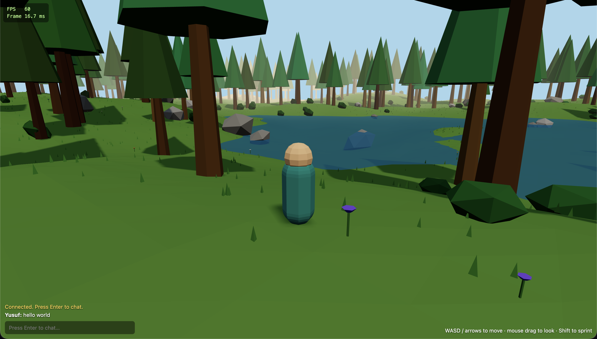

# Simple 3D Open World

A lightweight low-poly 3D open world you can roam in the browser — procedurally
generated woods with hills, lakes, rocks and flowers, third-person controls,
mobile touch support, and real-time multiplayer with chat. Built with
[Three.js](https://threejs.org/) and [Vite](https://vitejs.dev/), no heavy
framework.



## Features

- **Procedural world** — terrain, trees, rocks and ground clutter generated from
  seeded noise, so the woods are large and stable across reloads.
- **Third-person controls** — WASD / arrow keys to move, mouse-drag to look,
  Shift to sprint. Collision against trees and rocks.
- **Low-poly + efficient** — flat-shaded geometry and `InstancedMesh` keep
  thousands of trees, rocks and grass tufts at a steady 60fps. Tiny download.
- **Water** — calm low-poly ponds and lakes fill the valleys.
- **Multiplayer + chat** — see other players move in real time and chat with
  them, powered by a small WebSocket server.
- **Mobile** — on-screen joystick, sprint button, and fullscreen toggle
  (landscape).
- **Live FPS / frame-time HUD.**

## Quick start

Requires [Node.js](https://nodejs.org/) 18+.

```bash
npm install
```

Run the web app and the multiplayer server in **two terminals**:

```bash
npm run dev      # web app  → http://localhost:5173
npm run server   # game server → ws://localhost:8080
```

Open http://localhost:5173, enter a name, and explore. Open a second tab (or
another device on your network) to see multiplayer in action.

> The multiplayer server is optional for single-player roaming — if it isn't
> running, the game just reports "playing solo" and works fine.

## Controls

| Action      | Desktop                | Mobile (landscape)        |
| ----------- | ---------------------- | ------------------------- |
| Move        | WASD / arrow keys      | Left thumb joystick       |
| Look        | Drag with the mouse    | Drag anywhere on screen   |
| Sprint      | Hold Shift             | Hold the ▶▶ button        |
| Chat        | Enter to type & send   | Tap the chat field → Send |
| Fullscreen  | —                      | ⛶ button (top-right)      |

## Play on a phone (local network)

1. Run the dev server exposed to your LAN: `npm run dev -- --host`
2. Keep the game server running: `npm run server`
3. On your phone (same Wi-Fi), open `http://<your-computer-ip>:5173`
4. Rotate to landscape.

The client auto-connects to the game server on the same host, so no extra
config is needed for LAN play.

## Project layout

```
index.html              Entry page + global styles
server/server.js        WebSocket multiplayer server (Node + ws)
src/
  main.js               Renderer, scene, lighting, game loop, wiring
  world.js              Procedural terrain, trees, rocks, clutter, water
  noise.js              Seeded value noise used for generation
  player.js             Local player avatar, movement, camera
  remotePlayers.js      Other players' avatars + name labels
  network.js            Client WebSocket wrapper
  chat.js               Chat box UI
  touchControls.js      Mobile joystick + sprint button
  fullscreen.js         Fullscreen toggle button
  stats.js              FPS / frame-time overlay
```

Most world parameters (size, hill height, tree/rock/grass counts, water level)
live in the `WORLD` object at the top of `src/world.js`.

## Deploying multiplayer

The web app is static — build it with `npm run build` and host the `dist/`
folder anywhere (GitHub Pages, Netlify, etc.).

The game server needs a Node host that allows WebSocket connections. Free tiers
that work well: **Render**, **Fly.io**, **Railway**. The server reads `PORT`
from the environment, so most platforms run it as-is.

Point the client at your deployed server by setting `VITE_SERVER_URL` at build
time:

```bash
VITE_SERVER_URL=wss://your-app.onrender.com npm run build
```

## License

MIT
